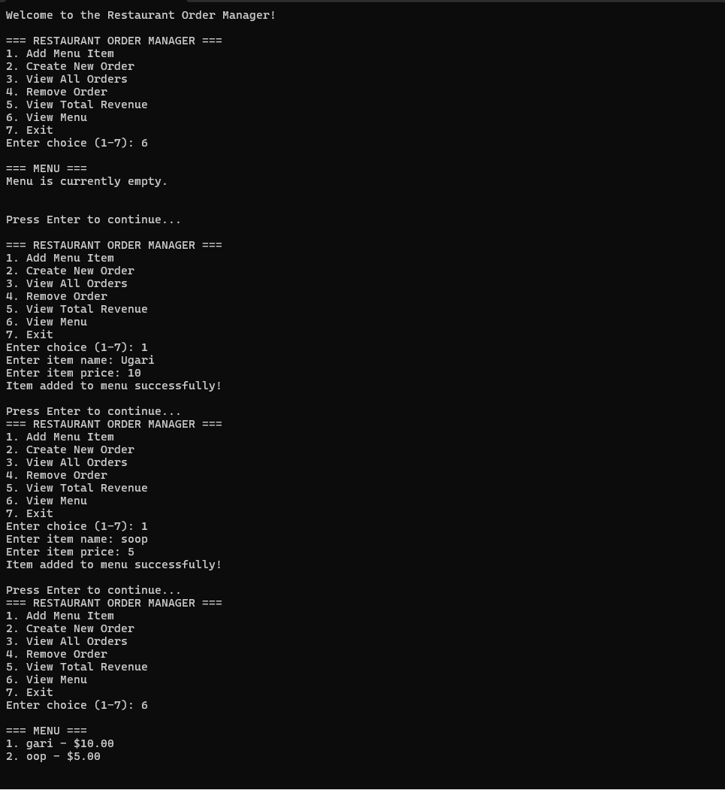
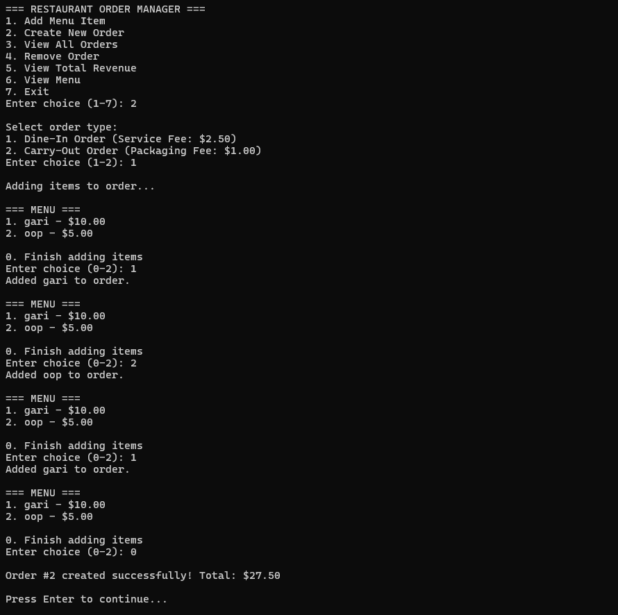
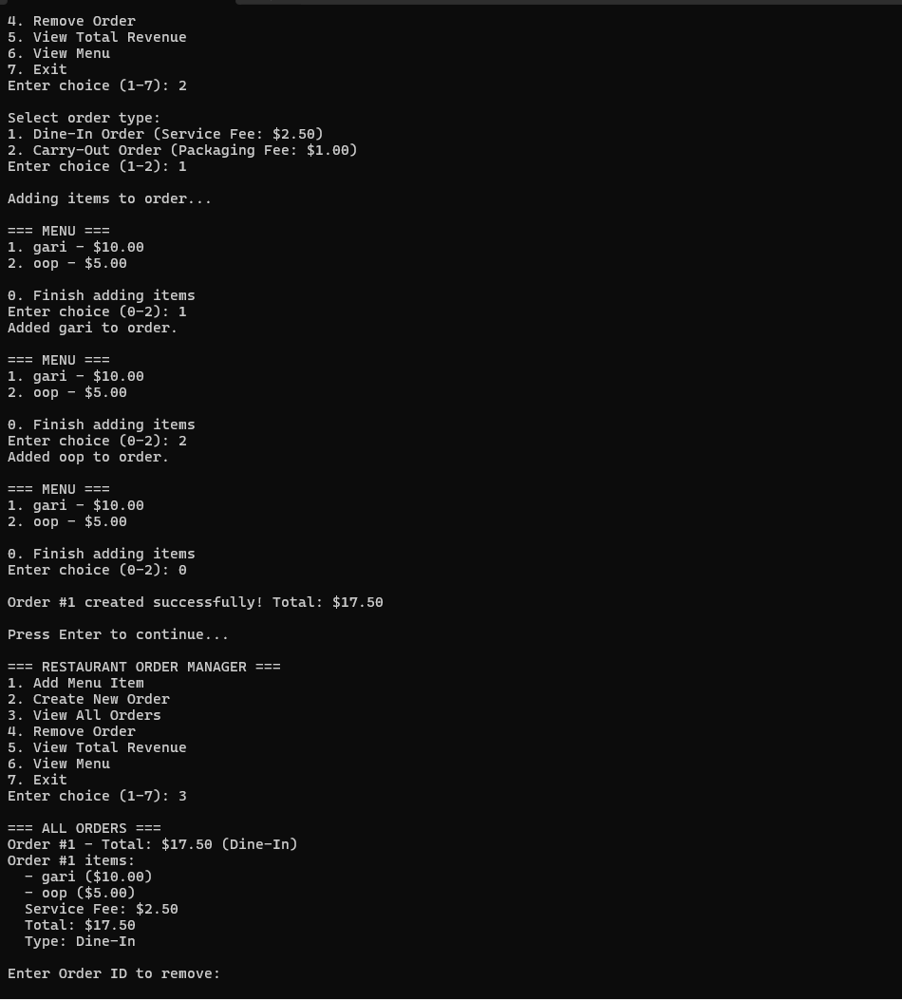
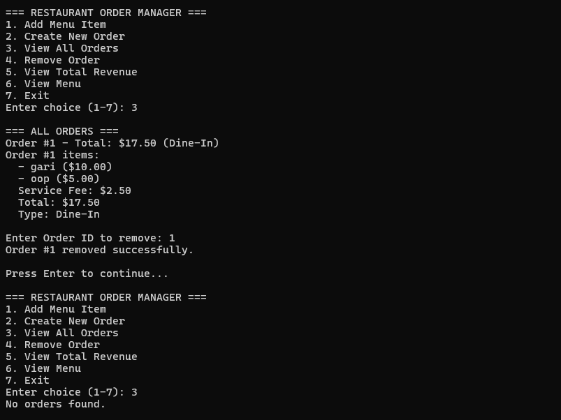

# Restaurant Order Manager

## Overview
This is a comprehensive C++ console application that manages restaurant orders, menu items, and revenue tracking. The system demonstrates object-oriented programming principles including inheritance, polymorphism, dynamic memory management, and abstract classes.

## Task Description
The assigned task was to create a restaurant order management system that:
- Manages a dynamic menu of food items
- Creates and tracks different types of orders (Dine-In and Carry-Out)
- Implements inheritance hierarchy with abstract base classes
- Provides comprehensive order management capabilities
- Tracks revenue and order statistics

## Features
- **Menu Management**: Add items to a dynamic menu
- **Order Types**: Support for Dine-In (with service fee) and Carry-Out (with packaging fee) orders
- **Dynamic Memory Management**: Automatically resizing arrays for orders and menu items
- **Order Tracking**: Unique order IDs and comprehensive order history
- **Revenue Calculation**: Total revenue tracking across all orders
- **Interactive Interface**: User-friendly console menu system

## Annotated Code Explanation

### Menu Item Structure
```cpp
// MenuItem structure - Simple data container for menu items
struct MenuItem {
    char name[30];  // Fixed-size character array for item name
    float price;    // Price of the menu item
};

// Static menu array (starts empty) - Global storage for all menu items
static MenuItem menu[20] = {};  // Array of 20 menu items, initialized to empty
static int menuSize = 0;        // Counter tracking current number of menu items
```

### Abstract Order Class
```cpp
// Abstract Order class - Base class for all order types
class Order {
protected:
    MenuItem** items;           // Dynamic array of pointers to menu items
    int nItems;                // Current number of items in order
    int capacity;              // Current capacity of items array
    static int nextOrderId;    // Static counter for generating unique order IDs
    int orderId;               // Unique identifier for this order

public:
    // Constructor - Initializes order with default capacity
    Order() : items(nullptr), nItems(0), capacity(0) {
        orderId = ++nextOrderId;        // Assign unique ID and increment counter
        items = new MenuItem*[10];      // Allocate initial array of 10 pointers
        capacity = 10;                  // Set initial capacity
    }

    // Virtual destructor - Ensures proper cleanup in derived classes
    virtual ~Order() {
        delete[] items;  // Free dynamically allocated array
    }

    // Add item to order with dynamic array resizing
    void addItem(MenuItem* item) {
        if (nItems >= capacity) {               // Check if array is full
            MenuItem** newItems = new MenuItem*[capacity * 2];  // Create larger array
            for (int i = 0; i < nItems; i++) {
                newItems[i] = items[i];         // Copy existing pointers
            }
            delete[] items;                     // Free old array
            items = newItems;                   // Update pointer to new array
            capacity *= 2;                      // Double the capacity
        }
        items[nItems++] = item;                 // Add new item and increment counter
    }

    // Calculate total price of all items using pointer arithmetic
    float getItemsTotal() const {
        float total = 0.0f;
        MenuItem** ptr = items;                 // Create pointer to start of array
        for (int i = 0; i < nItems; i++) {
            total += (*(ptr + i))->price;       // Dereference pointer and access price
        }
        return total;
    }

    // Pure virtual function - must be implemented by derived classes
    virtual float getTotal() const = 0;

    // Getter methods for order information
    int getOrderId() const { return orderId; }
    int getItemCount() const { return nItems; }

    // Display all items in the order
    void displayItems() const {
        cout << "Order #" << orderId << " items:\n";
        for (int i = 0; i < nItems; i++) {
            cout << "  - " << items[i]->name << " ($" 
                 << fixed << setprecision(2) << items[i]->price << ")\n";
        }
    }
};

// Initialize static member - shared across all Order instances
int Order::nextOrderId = 0;
```

### Derived Order Classes
```cpp
// DineInOrder class - Adds service fee to base order
class DineInOrder : public Order {
private:
    float serviceFee;  // Additional fee for dine-in service

public:
    // Constructor with default service fee
    DineInOrder(float fee = 2.50f) : Order(), serviceFee(fee) {}

    // Override virtual function to include service fee
    float getTotal() const override {
        return getItemsTotal() + serviceFee;
    }

    // Display order with service fee breakdown
    void displayOrder() const {
        displayItems();                                           // Show items from base class
        cout << "  Service Fee: $" << fixed << setprecision(2) << serviceFee << "\n";
        cout << "  Total: $" << fixed << setprecision(2) << getTotal() << "\n";
        cout << "  Type: Dine-In\n\n";
    }
};

// CarryOutOrder class - Adds packaging fee to base order
class CarryOutOrder : public Order {
private:
    float packagingFee;  // Additional fee for packaging

public:
    // Constructor with default packaging fee
    CarryOutOrder(float fee = 1.00f) : Order(), packagingFee(fee) {}

    // Override virtual function to include packaging fee
    float getTotal() const override {
        return getItemsTotal() + packagingFee;
    }

    // Display order with packaging fee breakdown
    void displayOrder() const {
        displayItems();                                              // Show items from base class
        cout << "  Packaging Fee: $" << fixed << setprecision(2) << packagingFee << "\n";
        cout << "  Total: $" << fixed << setprecision(2) << getTotal() << "\n";
        cout << "  Type: Carry-Out\n\n";
    }
};
```

### Order Manager Class
```cpp
// Order Manager - Handles collection of all orders
class RestaurantOrderManager {
private:
    Order** orders;    // Dynamic array of pointers to Order objects
    int nOrders;       // Current number of orders
    int capacity;      // Current capacity of orders array

public:
    // Constructor - Initialize with default capacity
    RestaurantOrderManager() : orders(nullptr), nOrders(0), capacity(0) {
        orders = new Order*[10];  // Allocate initial array
        capacity = 10;
    }

    // Destructor - Clean up all orders and array
    ~RestaurantOrderManager() {
        for (int i = 0; i < nOrders; i++) {
            delete orders[i];  // Delete each order object
        }
        delete[] orders;       // Delete the array itself
    }

    // Add order with dynamic array resizing
    void addOrder(Order* order) {
        if (nOrders >= capacity) {                    // Check if array is full
            Order** newOrders = new Order*[capacity * 2];  // Create larger array
            for (int i = 0; i < nOrders; i++) {
                newOrders[i] = orders[i];             // Copy existing pointers
            }
            delete[] orders;                          // Free old array
            orders = newOrders;                       // Update pointer
            capacity *= 2;                            // Double capacity
        }
        orders[nOrders++] = order;                    // Add order and increment counter
    }

    // Remove order by ID with array compaction
    bool removeOrder(int orderId) {
        for (int i = 0; i < nOrders; i++) {
            if (orders[i]->getOrderId() == orderId) {
                delete orders[i];                     // Delete the order object
                // Shift remaining orders left to fill gap
                for (int j = i; j < nOrders - 1; j++) {
                    orders[j] = orders[j + 1];
                }
                nOrders--;                            // Decrement counter
                
                // Shrink array if it's too large (prevent memory waste)
                if (nOrders < capacity / 4 && capacity > 10) {
                    Order** newOrders = new Order*[capacity / 2];
                    for (int k = 0; k < nOrders; k++) {
                        newOrders[k] = orders[k];
                    }
                    delete[] orders;
                    orders = newOrders;
                    capacity /= 2;
                }
                return true;  // Successfully removed
            }
        }
        return false;  // Order not found
    }

    // Display all orders using polymorphism
    void displayAllOrders() const {
        if (nOrders == 0) {
            cout << "No orders found.\n\n";
            return;
        }

        cout << "\n=== ALL ORDERS ===\n";
        for (int i = 0; i < nOrders; i++) {
            cout << "Order #" << orders[i]->getOrderId()
                 << " - Total: $" << fixed << setprecision(2) << orders[i]->getTotal();

            // Use dynamic casting to determine order type
            DineInOrder* dineIn = dynamic_cast<DineInOrder*>(orders[i]);
            CarryOutOrder* carryOut = dynamic_cast<CarryOutOrder*>(orders[i]);

            if (dineIn) {
                cout << " (Dine-In)\n";
                dineIn->displayOrder();               // Call specific display method
            } else if (carryOut) {
                cout << " (Carry-Out)\n";
                carryOut->displayOrder();             // Call specific display method
            }
        }
    }

    // Calculate total revenue across all orders
    float getTotalRevenue() const {
        float total = 0.0f;
        for (int i = 0; i < nOrders; i++) {
            total += orders[i]->getTotal();           // Use virtual function
        }
        return total;
    }

    // Get number of orders
    int getOrderCount() const { return nOrders; }
};
```

### Utility Functions
```cpp
// Display current menu items
void displayMenu() {
    cout << "\n=== MENU ===\n";
    if (menuSize == 0) {
        cout << "Menu is currently empty.\n\n";
        return;
    }
    // Loop through menu and display each item with numbering
    for (int i = 0; i < menuSize; i++) {
        cout << (i + 1) << ". " << menu[i].name
             << " - $" << fixed << setprecision(2) << menu[i].price << "\n";
    }
    cout << "\n";
}

// Get valid user input within specified range
int getValidChoice(int min, int max) {
    int choice;
    while (true) {
        cout << "Enter choice (" << min << "-" << max << "): ";
        cin >> choice;
        // Check for invalid input or out of range
        if (cin.fail() || choice < min || choice > max) {
            cin.clear();                    // Clear error flag
            cin.ignore(10000, '\n');       // Clear input buffer
            cout << "Invalid choice. Please try again.\n";
        } else {
            cin.ignore(10000, '\n');       // Clear remaining input
            return choice;
        }
    }
}

// Add new menu item with input validation
void addMenuItem() {
    if (menuSize >= 20) {
        cout << "Menu is full. Cannot add more items.\n";
        return;
    }

    MenuItem newItem;
    cout << "Enter item name: ";
    cin.ignore();                           // Clear input buffer
    cin.getline(newItem.name, 30);         // Read full line including spaces

    cout << "Enter item price: ";
    cin >> newItem.price;

    menu[menuSize++] = newItem;             // Add to menu and increment size
    cout << "Item added to menu successfully!\n";
}

// Create new order with user interaction
Order* createOrder() {
    if (menuSize == 0) {
        cout << "\nMenu is empty. Please add menu items before creating an order.\n";
        return nullptr;
    }

    // Get order type from user
    cout << "\nSelect order type:\n";
    cout << "1. Dine-In Order (Service Fee: $2.50)\n";
    cout << "2. Carry-Out Order (Packaging Fee: $1.00)\n";

    int orderType = getValidChoice(1, 2);

    // Create appropriate order type using polymorphism
    Order* order;
    if (orderType == 1) {
        order = new DineInOrder();          // Create dine-in order
    } else {
        order = new CarryOutOrder();        // Create carry-out order
    }

    // Add items to order
    cout << "\nAdding items to order...\n";
    while (true) {
        displayMenu();
        cout << "0. Finish adding items\n";

        int itemChoice = getValidChoice(0, menuSize);
        if (itemChoice == 0) break;         // User finished adding items

        order->addItem(&menu[itemChoice - 1]);  // Add selected item
        cout << "Added " << menu[itemChoice - 1].name << " to order.\n";
    }

    return order;  // Return completed order
}
```

### Main Program Flow
```cpp
int main() {
    RestaurantOrderManager manager;  // Create order manager instance

    cout << "Welcome to the Restaurant Order Manager!\n";

    // Main program loop
    while (true) {
        displayMainMenu();                   // Show menu options
        int choice = getValidChoice(1, 7);   // Get user choice

        switch (choice) {
            case 1:  // Add Menu Item
                addMenuItem();
                break;

            case 2: {  // Create New Order
                Order* newOrder = createOrder();
                if (newOrder != nullptr) {
                    manager.addOrder(newOrder);  // Add to manager
                    cout << "\nOrder #" << newOrder->getOrderId()
                         << " created successfully! Total: $"
                         << fixed << setprecision(2) << newOrder->getTotal() << "\n";
                }
                break;
            }

            case 3:  // View All Orders
                manager.displayAllOrders();
                break;

            case 4: {  // Remove Order
                cout << "Enter Order ID to remove: ";
                int orderId;
                cin >> orderId;
                cin.ignore(10000, '\n');
                if (manager.removeOrder(orderId)) {
                    cout << "Order #" << orderId << " removed successfully.\n";
                } else {
                    cout << "Order #" << orderId << " not found.\n";
                }
                break;
            }

            case 5:  // View Total Revenue
                cout << "\nTotal Revenue: $" << fixed << setprecision(2)
                     << manager.getTotalRevenue() << "\n";
                cout << "Number of Orders: " << manager.getOrderCount() << "\n";
                break;

            case 6:  // View Menu
                displayMenu();
                break;

            case 7:  // Exit
                cout << "Thank you for using Restaurant Order Manager!\n";
                return 0;
        }

        cout << "\nPress Enter to continue...";
        cin.get();  // Wait for user input before continuing
    }

    return 0;
}
```

## Key Programming Concepts Demonstrated

### 1. Object-Oriented Programming
- **Inheritance**: DineInOrder and CarryOutOrder inherit from Order
- **Polymorphism**: Virtual functions allow different behavior for order types
- **Encapsulation**: Private data members with public interfaces
- **Abstraction**: Abstract Order class defines common interface

### 2. Dynamic Memory Management
- Dynamic array allocation and reallocation
- Proper cleanup in destructors
- Memory-efficient resizing algorithms

### 3. Other C++ Features
- Static member variables for unique ID generation
- Dynamic casting for runtime type identification
- Pointer arithmetic for efficient array traversal
- Virtual destructors for proper cleanup

### 4. Error Handling
- Input validation with retry loops
- Boundary checking for array operations
- Null pointer checks

## Sample Program Execution screshots 




## Compilation and Execution

### Prerequisites
- C++ compiler (g++, clang++, or Visual Studio)
- Standard C++ libraries

### Compilation Command
```bash
g++ -o restaurant_manager restaurant_manager.cpp
```

### Execution
```bash
./restaurant_manager
```

## Conclusion
This Restaurant Order Manager successfully demonstrates C++ programming concepts including inheritance, polymorphism, dynamic memory management, and object-oriented design principles. The system provides a comprehensive solution for managing and  error handling.